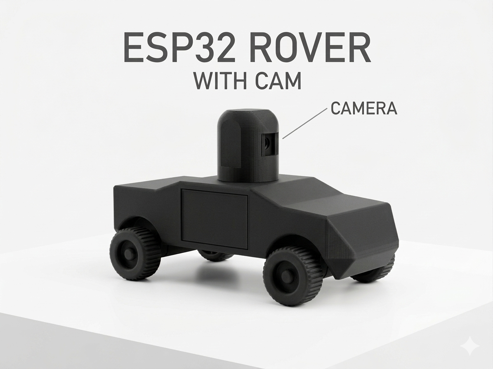
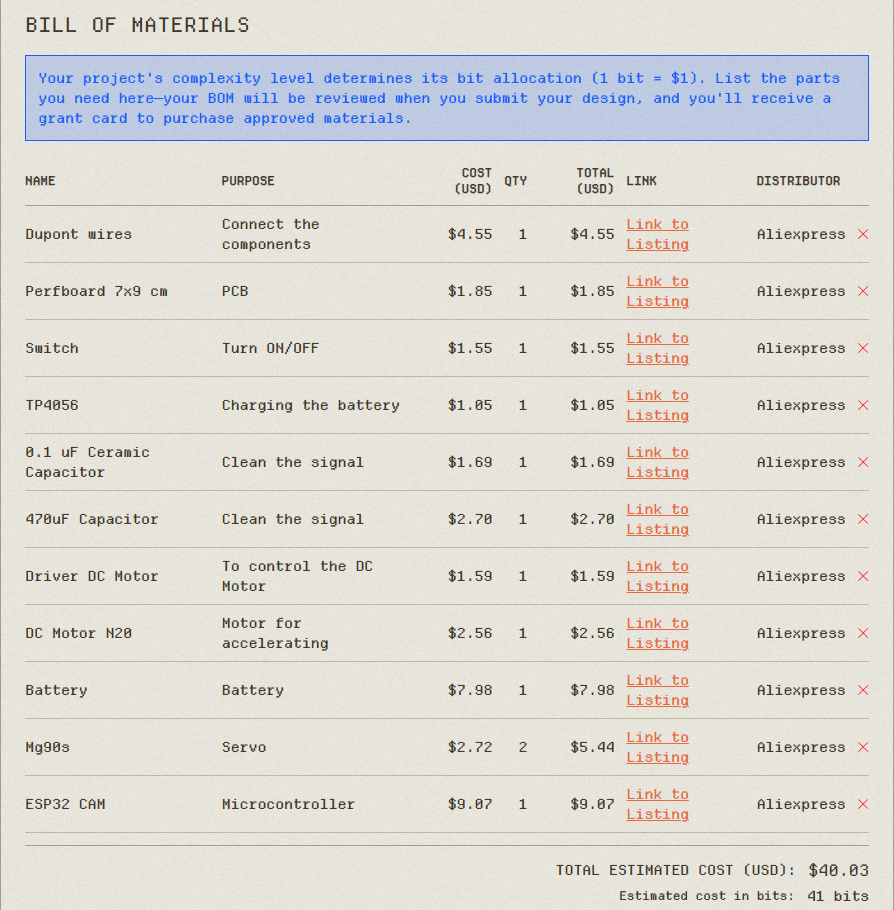

# ESP32 Rover

Project developed as part of the **Statis Hack Club** program.

## Overview
This project is a small FPV rover built using an ESP32-CAM.  
The rover can stream live video while being remotely controlled, allowing the user to drive it and move the camera to look around.

## Features
- Live FPV video streaming
- Front wheel steering using a servo motor
- Camera tilt control with a second servo
- Rear DC motor for movement
- Rechargeable battery power system

## Hardware
Main components used in this project:

- ESP32-CAM
- MG90S Servo Motor (x2)
- DC Motor
- MX1508 Motor Driver
- TP4056 Charging Module
- 3.7V LiPo Battery
- Capacitors (470µF and 0.1µF)

## Project Status
The project is currently in the **design phase**.  
Components have been selected and the initial schematic has been created.

## Author
Personal electronics project focused on learning embedded systems, robotics, and hardware design.
